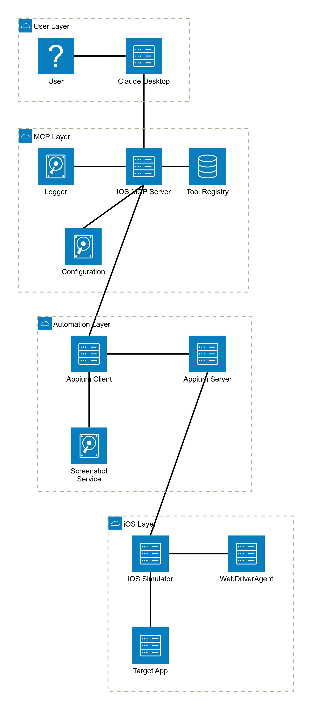
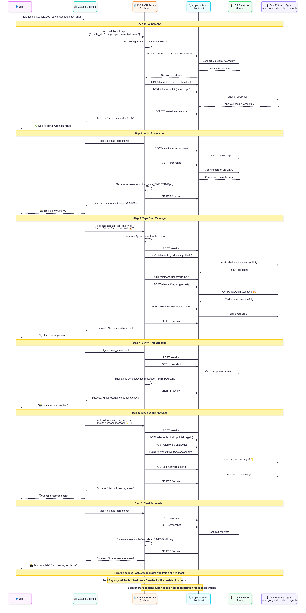

# iOS MCP Server

> Professional iOS automation server built with clean architecture and SOLID principles

[](https://opensource.org/licenses/MIT)
[](https://www.python.org/downloads/)
[](https://www.apple.com/macos/)

A production-ready iOS automation MCP server that transforms monolithic automation scripts into maintainable, extensible architecture. Built following SOLID principles with comprehensive error handling, beautiful logging, and professional design patterns.

## ✨ Features

- 🏗️ **Clean Architecture** - SOLID principles and design patterns
- 🎨 **Beautiful Logging** - Colored console output with emojis
- 🔧 **Type-Safe** - Comprehensive type hints throughout
- 📱 **Real iOS Automation** - Appium + WebDriverAgent integration
- 🔌 **Extensible** - Plugin-style tool system
- 🚀 **Production Ready** - Robust error handling and monitoring

## 🚀 Quick Start

### Prerequisites

- macOS (required for iOS automation)
- Python 3.11+
- Xcode with iOS Simulator
- Node.js (for Appium)

### Installation

1. **Clone the repository**
   ```bash
   git clone https://github.com/iHackSubhodip/mcp-server-demo.git
   cd mcp-server-demo
   ```

2. **Start the server**
   ```bash
   ./start_ios_mcp.sh
   ```

3. **Connect to Claude Desktop**
   
   Add to your Claude Desktop config:
   ```json
   {
     "mcpServers": {
       "ios-automation": {
         "command": "python",
         "args": ["-m", "ios_mcp_server.main"],
         "cwd": "/path/to/mcp-server-demo"
       }
     }
   }
   ```

## 🏗️ Architecture

### System Architecture


### Module Interactions


### Sequence Flow


### Directory Structure
```
ios_mcp_server/
├── main.py                       # Entry point
├── config/settings.py           # Configuration
├── utils/                       # Shared utilities
│   ├── logger.py               # Colored logging
│   ├── exceptions.py           # Custom exceptions
│   └── command_runner.py       # Async commands
├── automation/                  # Core services
│   ├── appium_client.py        # iOS automation
│   ├── simulator_manager.py    # Simulator control
│   └── screenshot_service.py   # Screenshots
├── tools/                       # MCP tools
│   ├── base_tool.py            # Abstract base
│   ├── tool_registry.py        # Tool management
│   ├── appium_tap_type_tool.py # Main automation
│   ├── screenshot_tool.py      # Screenshot capture
│   └── launch_app_tool.py      # App launcher
└── server/mcp_server.py         # MCP protocol
```

## 🔧 Available Tools

### `appium_tap_and_type`
Real iOS automation with intelligent element finding
```json
{
  "text": "Hello World!",
  "element_type": "textField",
  "timeout": 10
}
```

### `take_screenshot`
Capture high-quality iOS screenshots
```json
{
  "filename": "optional_name.png"
}
```

### `launch_app`
Launch iOS applications with validation
```json
{
  "bundle_id": "com.example.app"
}
```

## 🎮 Server Management

### Start Server
```bash
./start_ios_mcp.sh
```

### Restart Server
```bash
pkill -f "ios_mcp_server" || true
pkill -f appium || true
./start_ios_mcp.sh
```

### Stop Server
```bash
pkill -f "ios_mcp_server|appium"
```

### Check Status
```bash
ps aux | grep -E "(ios_mcp_server|appium)" | grep -v grep
curl -s http://localhost:4723/status | python3 -m json.tool
```

## 🏭 Design Patterns

- **Template Method**: `BaseTool` consistent execution
- **Registry**: `ToolRegistry` centralized management  
- **Factory**: Tool instantiation
- **Strategy**: Multiple automation approaches
- **Dependency Injection**: Configuration injection

## 📊 Migration Benefits

| Before | After |
|--------|-------|
| 414-line monolithic file | 20+ focused modules |
| No error handling | Professional error handling |
| Basic logging | Colored logging with emojis |
| Hard to extend | Plugin-style architecture |
| No type safety | 100% type-hinted |
| Poor maintainability | SOLID principles |

## 🛠️ Development Setup

### Manual Setup
```bash
# Create virtual environment
python -m venv ios_mcp_env
source ios_mcp_env/bin/activate

# Install dependencies
pip install -r requirements.txt

# Install Appium
npm install -g appium
appium driver install xcuitest
```

### WebDriverAgent Setup
```bash
git clone https://github.com/appium/WebDriverAgent.git
open WebDriverAgent/WebDriverAgent.xcodeproj
```

Configure in Xcode:
- Select your Apple Developer Team
- Update Bundle IDs to be unique
- Build and test the project

## 🔍 Troubleshooting

### Appium Connection Issues
```bash
# Check Appium status
curl http://localhost:4723/status

# Restart Appium
pkill -f appium && appium server --port 4723
```

### Simulator Issues
```bash
# List simulators
xcrun simctl list devices

# Boot simulator
xcrun simctl boot "iPhone 16 Pro"
```

### WebDriverAgent Issues
```bash
cd WebDriverAgent
xcodebuild -project WebDriverAgent.xcodeproj \
  -scheme WebDriverAgentRunner \
  -destination 'platform=iOS Simulator,name=iPhone 16 Pro' test
```

## 📝 Dependencies

```
mcp>=1.0.0          # MCP protocol
aiohttp>=3.9.0      # HTTP client for Appium
```

## 🤝 Contributing

1. Fork the repository
2. Create a feature branch
3. Make your changes
4. Add tests if applicable
5. Submit a pull request

## 📄 License

This project is licensed under the MIT License - see the [LICENSE](LICENSE) file for details.

