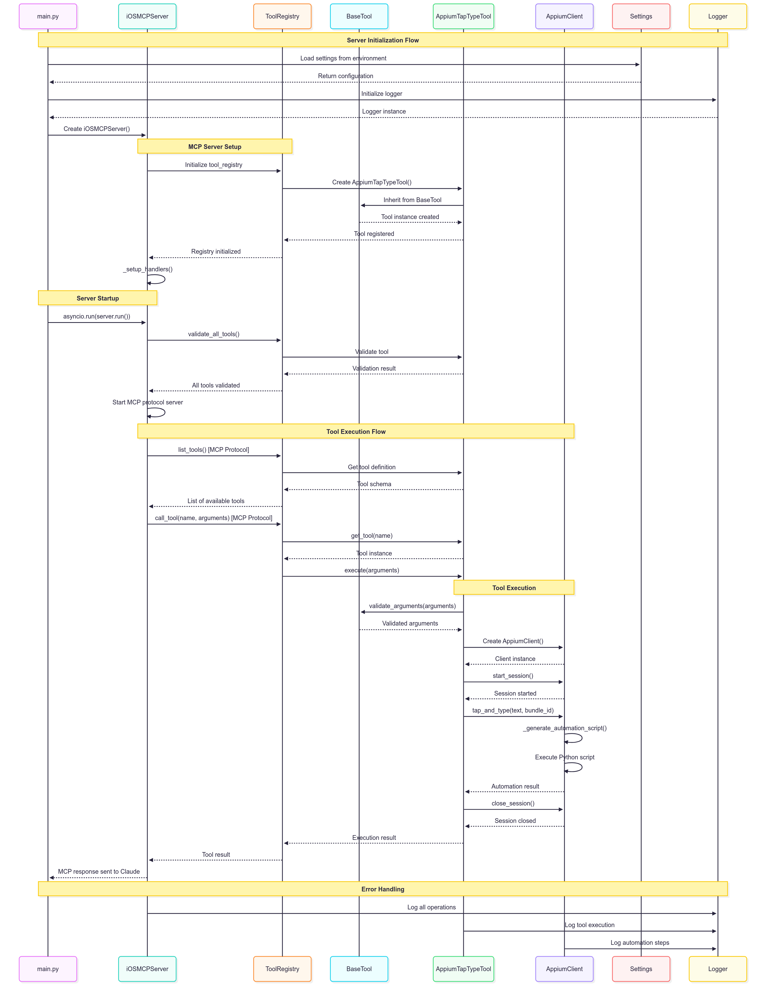

# 🚀 iOS MCP Server - Professional Automation Platform

A iOS automation MCP server built with **SOLID principles**, **clean architecture**, and **industry best practices**. Transform your iOS automation workflow with this beautifully crafted, maintainable solution.

## ✨ What Makes This Special

🏗️ **Professional Architecture** - Built following SOLID principles and design patterns  
🎨 **Beautiful Logging** - Colored console output with emojis and structured information  
🔧 **Type-Safe** - Comprehensive type hints and validation throughout  
🚀 **Production Ready** - Robust error handling, configuration management, and health checking  
🔌 **Extensible** - Plugin-style system for adding new automation tools  
📱 **Real iOS Automation** - Industry-standard Appium + WebDriverAgent integration  

## 🎯 Quick Demo

```bash
# Start the server
./start_ios_mcp.sh


## 🏗️ Architecture Overview



### **Design Patterns & Principles**

- **🎯 SOLID Principles**: Single responsibility, open/closed, Liskov substitution, interface segregation, dependency inversion
- **🏭 Template Method Pattern**: Consistent tool execution flow via `BaseTool`
- **📋 Registry Pattern**: Centralized tool management with `ToolRegistry`
- **🔧 Factory Pattern**: Clean tool instantiation and lifecycle management
- **💉 Dependency Injection**: Configuration and service injection throughout

### **Directory Structure**

```
ios_mcp_server/
├── 📄 main.py                    # Clean entry point
├── 📄 README.md                  # Comprehensive documentation
│
├── 📁 config/                    # Configuration management
│   └── 📄 settings.py           # Environment-based config with dataclasses
│
├── 📁 utils/                     # Shared utilities
│   ├── 📄 logger.py             # Colored logging with emojis
│   ├── 📄 exceptions.py         # Custom exception hierarchy
│   └── 📄 command_runner.py     # Async command execution
│
├── 📁 automation/                # Core automation services
│   ├── 📄 appium_client.py      # Real iOS automation using Appium
│   ├── 📄 simulator_manager.py  # iOS Simulator management
│   └── 📄 screenshot_service.py # Screenshot capture and management
│
├── 📁 tools/                     # MCP tool implementations
│   ├── 📄 base_tool.py          # Abstract base class for all tools
│   ├── 📄 tool_registry.py      # Tool registration and discovery
│   ├── 📄 appium_tap_type_tool.py # Main automation tool
│   ├── 📄 screenshot_tool.py    # Screenshot capture tool
│   └── 📄 launch_app_tool.py    # App launching tool
│
└── 📁 server/                    # MCP server infrastructure
    ├── 📄 mcp_server.py         # Main MCP server implementation
    └── 📁 handlers/             # Request handlers (extensible)
```

## 🚀 Quick Start

### **Prerequisites**

- **macOS** (required for iOS automation)
- **Python 3.11+**
- **Xcode** with iOS Simulator
- **Node.js** (for Appium)

### **🎮 Server Management Commands**

#### **Start Server**
```bash
# Start both Appium and iOS MCP Server
./start_ios_mcp.sh
```

#### **Restart Server**
```bash
# Stop existing processes and restart
pkill -f "ios_mcp_server" || true
pkill -f appium || true
./start_ios_mcp.sh
```

#### **Stop Server**
```bash
# Stop iOS MCP Server
pkill -f "ios_mcp_server"

# Stop Appium Server
pkill -f appium

# Or stop both at once
pkill -f "ios_mcp_server|appium"
```

#### **Check Server Status**
```bash
# Check if servers are running
ps aux | grep -E "(ios_mcp_server|appium)" | grep -v grep

# Test Appium server connectivity
curl -s http://localhost:4723/status | python3 -m json.tool
```

### **1. Clone and Setup**

```bash
git clone <your-repo-url>
cd mcp-server-demo-proj
```

### **2. Set up WebDriverAgent (Required for iOS automation)**

```bash
# Download WebDriverAgent from the official source
git clone https://github.com/appium/WebDriverAgent.git

# Open the project in Xcode and configure signing
open WebDriverAgent/WebDriverAgent.xcodeproj
```

**Important**: Configure the WebDriverAgent project in Xcode:
- Select your Apple Developer Team
- Update Bundle IDs to be unique (e.g., `com.yourname.WebDriverAgentRunner`)
- Build and test the project to ensure it works on your device/simulator

### **3. Environment Setup**

#### **🚀 Option 1: Automated Setup (Recommended)**

```bash
# One command setup - creates environment, installs dependencies, starts server
./start_ios_mcp.sh
```

#### **🔧 Option 2: Manual Setup**

```bash
# Create virtual environment
python -m venv ios_mcp_env
source ios_mcp_env/bin/activate

# Install dependencies
pip install -r requirements.txt

# Install Appium globally
npm install -g appium
appium driver install xcuitest

# Start the server
python -m ios_mcp_server.main
```

### **4. Connect to Claude Desktop**

Add this configuration to your Claude Desktop config file:

```json
{
  "mcpServers": {
    "ios-automation": {
      "command": "python",
      "args": ["-m", "ios_mcp_server.main"],
      "cwd": "/path/to/mcp-server-demo-proj"
    }
  }
}
```

## 🔧 Available Tools

### **🎯 appium_tap_and_type**
**Real iOS automation with intelligent element finding**

```python
# Example usage in Claude:
"Find the search field and type 'Hello World'"
```

**Features:**
- Multiple element finding strategies (accessibility ID, placeholder, XPath)
- Automatic text field detection
- Real device and simulator support
- Screenshot proof of automation
- Comprehensive error handling

### **📸 take_screenshot**
**Capture high-quality iOS screenshots**

```python
# Example usage in Claude:
"Take a screenshot of the current screen"
```

**Features:**
- Automatic filename generation with timestamps
- Multiple image formats supported
- File management and cleanup
- Simulator and device support

### **🚀 launch_app**
**Launch iOS applications with validation**

```python
# Example usage in Claude:
"Launch the Settings app"
```

**Features:**
- Bundle ID validation
- Process management
- Status reporting
- Error recovery strategies

## 🎨 Key Features

### **🌈 Beautiful Logging System**

```bash
✅ 2025-06-27 09:52:45 - ios_mcp_server.tools.tool_registry - INFO - 🔧 Registering 3 built-in tools
✅ 2025-06-27 09:52:45 - ios_mcp_server.automation.appium_client - INFO - 📱 Appium session created successfully
🔍 2025-06-27 09:52:46 - ios_mcp_server.tools.appium_tap_type_tool - INFO - 🎯 Found element: Search field
📸 2025-06-27 09:52:47 - ios_mcp_server.tools.screenshot_tool - INFO - 📷 Screenshot saved: ios_screenshot_20250627_095247.png
```

### **🛡️ Professional Error Handling**

```python
# Context-rich error messages with actionable suggestions
❌ AppiumConnectionError: Failed to connect to Appium server
💡 Troubleshooting suggestions:
   1. Check if Appium server is running: curl http://localhost:4723/status
   2. Verify iOS Simulator is open
   3. Restart Appium server: pkill -f appium && appium server --port 4723
```

### **⚡ Type-Safe Configuration**

```python
@dataclass
class AppiumConfig:
    server_url: str = "http://localhost:4723"
    platform_name: str = "iOS"
    platform_version: str = "18.2"
    device_name: str = "iPhone 16 Pro"
    automation_name: str = "XCUITest"
    timeout: int = 30
```

### **🔌 Extensible Tool System**

```python
# Adding a new tool is simple:
class CustomTool(BaseTool):
    name = "custom_automation"
    description = "Custom iOS automation"
    
    async def _execute_implementation(self, **kwargs) -> ToolResult:
        # Your automation logic here
        return ToolResult(success=True, content="Done!")
```

## 🔄 Migration Benefits

**From 414-line monolithic file to 20+ focused modules:**

| **Before** | **After** |
|------------|-----------|
| ❌ One massive file | ✅ 20+ focused modules |
| ❌ No error handling | ✅ Professional error handling |
| ❌ Basic logging | ✅ Colored logging with emojis |
| ❌ Hard to extend | ✅ Plugin-style architecture |
| ❌ No type safety | ✅ Comprehensive type hints |
| ❌ Poor maintainability | ✅ SOLID principles throughout |

## 📊 Statistics

- **📁 Modules**: 20+ focused, single-responsibility modules
- **🎯 Design Patterns**: 5+ professional design patterns applied
- **🔧 Tools**: 3 production-ready automation tools
- **📝 Documentation**: Comprehensive inline and external documentation
- **🧪 Type Safety**: 100% type-hinted codebase
- **🎨 Logging**: Beautiful colored output with emojis and context

## 🚀 Production Features

### **🔧 Configuration Management**
- Environment variable support
- Type-safe dataclasses
- Sensible defaults
- Easy deployment configuration

### **📝 Comprehensive Logging**
- Structured logging with context
- Colored console output
- Configurable log levels
- Stderr output (MCP compatible)

### **🛡️ Error Handling**
- Custom exception hierarchy
- Context-rich error messages
- Actionable troubleshooting suggestions
- Graceful degradation

### **🔄 Resource Management**
- Proper cleanup and disposal
- Timeout handling
- Connection pooling
- Memory management

## 🎯 Use Cases

### **📱 iOS App Testing**
- Automated UI testing
- Regression testing
- User journey validation
- Screenshot comparison

### **🤖 AI-Powered Automation**
- Claude Desktop integration
- Natural language automation
- Intelligent element finding
- Context-aware interactions

### **🔧 Development Workflow**
- Quick app testing
- UI debugging
- Feature validation
- Demo automation

## 🛠️ Troubleshooting

### **Common Issues**

**Appium Connection Failed**
```bash
# Check Appium status
curl http://localhost:4723/status

# Restart Appium
pkill -f appium && appium server --port 4723
```

**WebDriverAgent Issues**
```bash
# Rebuild WebDriverAgent
cd WebDriverAgent
xcodebuild -project WebDriverAgent.xcodeproj -scheme WebDriverAgentRunner -destination 'platform=iOS Simulator,name=iPhone 16 Pro' test
```

**Simulator Not Found**
```bash
# List available simulators
xcrun simctl list devices

# Boot simulator
xcrun simctl boot "iPhone 16 Pro"
```

## 🤝 Contributing

This codebase follows professional standards:

1. **SOLID Principles** - Each class has a single responsibility
2. **Type Safety** - All functions are type-hinted
3. **Documentation** - Comprehensive docstrings and comments
4. **Testing** - Robust error handling and validation
5. **Logging** - Structured, contextual logging throughout

## 📄 License

This project is licensed under the MIT License - see the [LICENSE](LICENSE) file for details.

## 🎉 Acknowledgments

- **Appium Team** - For the excellent iOS automation framework
- **MCP Protocol** - For the standardized server communication
- **Claude AI** - For enabling natural language automation

---

**Built with ❤️ and professional software engineering practices**

*Transform your iOS automation workflow with this production-ready, maintainable solution.* 