# iOS Automation MCP Server 🚀

A comprehensive **Model Context Protocol (MCP) server** for iOS development automation. This Python implementation enables AI assistants to interact with iOS simulators, perform accessibility testing, manage apps, and automate complex iOS workflows.

## 🎯 System Architecture

```mermaid
graph TB
    subgraph "Claude Desktop Environment"
        CD[Claude Desktop]
        CDConfig[claude_desktop_config.json<br/>User Configuration]
        CDLogs[~/Library/Logs/Claude/]
    end
    
    subgraph "MCP Server Layer"
        MCPServer[iOS MCP Server<br/>ios_mcp_server.py]
        VEnv[Python Virtual Environment<br/>ios_mcp_env/]
        MCPTools[13 iOS Automation Tools]
    end
    
    subgraph "iOS Simulator Layer"
        Simulator[iOS Simulator<br/>Any iPhone/iPad Model]
        TestApps[Test Applications<br/>User Apps & System Apps]
        SimulatorTools[simctl Commands]
    end
    
    subgraph "macOS System Layer"
        AppleScript[AppleScript<br/>UI Automation]
        Accessibility[Accessibility Permissions<br/>Terminal.app]
        Screenshots[Screenshot Storage<br/>/tmp/]
    end
    
    subgraph "Tool Categories"
        SimMgmt[Simulator Management<br/>• list_simulators<br/>• boot_simulator<br/>• shutdown_simulator<br/>• get_simulator_state]
        AppMgmt[App Management<br/>• launch_app<br/>• terminate_app<br/>• install_app<br/>• list_installed_apps]
        UIAuto[UI Automation<br/>• tap_coordinate<br/>• tap_element<br/>• type_text<br/>• get_accessibility_tree]
        Capture[Screen Capture<br/>• take_screenshot]
    end
    
    %% Connections
    CD --> MCPServer
    CDConfig -.-> CD
    MCPServer --> VEnv
    MCPServer --> MCPTools
    MCPServer --> CDLogs
    
    MCPTools --> SimMgmt
    MCPTools --> AppMgmt
    MCPTools --> UIAuto
    MCPTools --> Capture
    
    SimMgmt --> SimulatorTools
    AppMgmt --> SimulatorTools
    UIAuto --> AppleScript
    Capture --> SimulatorTools
    
    SimulatorTools --> Simulator
    AppleScript --> Accessibility
    AppleScript --> Simulator
    Simulator --> TestApps
    Capture --> Screenshots
```



### **Data Flow:**
1. **Claude Desktop** → **MCP Server** (JSON-RPC over stdio)
2. **MCP Server** → **simctl/AppleScript** (Command execution)
3. **System Tools** → **iOS Simulator** (Direct automation)
4. **Results/Screenshots** → **Claude Desktop** (Response data)

## 🏗️ High-Level Architecture

### **Design Principles**

The iOS MCP Server follows a **layered architecture** designed for:
- **Reliability**: Robust error handling and graceful failure recovery
- **Extensibility**: Modular tool design for easy feature additions
- **Performance**: Asynchronous operations and efficient resource usage
- **Security**: Sandboxed execution with controlled system access

### **Core Components**

#### **1. MCP Protocol Layer**
```
┌─────────────────────────────────────────────────────────┐
│                Claude Desktop                           │
│  ┌─────────────────────────────────────────────────┐    │
│  │            AI Assistant                         │    │
│  │  • Natural language processing                  │    │
│  │  • Intent recognition                          │    │
│  │  • Context management                          │    │
│  └─────────────────────────────────────────────────┘    │
└─────────────────────────────────────────────────────────┘
                            │
                   JSON-RPC over stdio
                            │
┌─────────────────────────────────────────────────────────┐
│                 MCP Server                              │
│  ┌─────────────────────────────────────────────────┐    │
│  │        Protocol Handler                         │    │
│  │  • JSON-RPC message parsing                     │    │
│  │  • Tool discovery & registration               │    │
│  │  • Resource management                         │    │
│  │  • Error handling & logging                    │    │
│  └─────────────────────────────────────────────────┘    │
└─────────────────────────────────────────────────────────┘
```

#### **2. Tool Orchestration Layer**
```
┌─────────────────────────────────────────────────────────┐
│                Tool Manager                             │
│                                                         │
│  ┌─────────────┐  ┌─────────────┐  ┌─────────────┐      │
│  │  Simulator  │  │     App     │  │     UI      │      │
│  │ Management  │  │ Management  │  │ Automation  │      │
│  │   Tools     │  │   Tools     │  │   Tools     │      │
│  └─────────────┘  └─────────────┘  └─────────────┘      │
│                                                         │
│  ┌─────────────────────────────────────────────────┐    │
│  │           Screen Capture Tools                  │    │
│  └─────────────────────────────────────────────────┘    │
└─────────────────────────────────────────────────────────┘
```

#### **3. System Integration Layer**
```
┌─────────────────────────────────────────────────────────┐
│               System Adapters                           │
│                                                         │
│  ┌─────────────┐  ┌─────────────┐  ┌─────────────┐      │
│  │   simctl    │  │ AppleScript │  │ File System │      │
│  │  Command    │  │ Automation  │  │  Operations │      │
│  │ Executor    │  │   Engine    │  │             │      │
│  └─────────────┘  └─────────────┘  └─────────────┘      │
└─────────────────────────────────────────────────────────┘
                            │
                    Native macOS APIs
                            │
┌─────────────────────────────────────────────────────────┐
│                iOS Simulator                            │
│  ┌─────────────────────────────────────────────────┐    │
│  │            Target Applications                  │    │
│  │  • User apps under test                        │    │
│  │  • System apps and services                    │    │
│  │  • UI accessibility hierarchy                  │    │
│  └─────────────────────────────────────────────────┘    │
└─────────────────────────────────────────────────────────┘
```

### **Architectural Patterns**

#### **Command Pattern Implementation**
Each tool implements the command pattern for:
- **Encapsulation**: Tool logic is self-contained
- **Undo/Redo**: Future support for operation reversal
- **Logging**: Comprehensive audit trail
- **Error Recovery**: Graceful handling of failures

#### **Adapter Pattern for System Integration**
```python
# Abstract interface for all system operations
class SystemAdapter:
    async def execute_command(self, command: str) -> Result
    
# Concrete implementations
class SimctlAdapter(SystemAdapter):
    # Handles iOS Simulator operations
    
class AppleScriptAdapter(SystemAdapter):
    # Handles UI automation via AppleScript
```

#### **Factory Pattern for Tool Creation**
```python
class ToolFactory:
    def create_tool(self, tool_type: str) -> Tool:
        # Dynamic tool instantiation based on type
```

### **Cross-Cutting Concerns**

#### **Error Handling Strategy**
```
┌─────────────────────────────────────────────────────────┐
│                 Error Handling                          │
│                                                         │
│  Client Error     │  Server Error     │  System Error   │
│  ┌─────────────┐  │  ┌─────────────┐  │  ┌─────────────┐ │
│  │ Validation  │  │  │  Internal   │  │  │   macOS     │ │
│  │   Errors    │  │  │ Processing  │  │  │ System API  │ │
│  │             │  │  │   Errors    │  │  │   Errors    │ │
│  └─────────────┘  │  └─────────────┘  │  └─────────────┘ │
│        │          │        │          │        │         │
│        └──────────┼────────┼──────────┼────────┘         │
│                   │        │          │                  │
│  ┌─────────────────────────────────────────────────────┐ │
│  │             Centralized Error Handler              │ │
│  │  • Categorization and severity assessment          │ │
│  │  • Structured logging with context                 │ │
│  │  • User-friendly error messages                    │ │
│  │  • Automatic retry for transient failures          │ │
│  └─────────────────────────────────────────────────────┘ │
└─────────────────────────────────────────────────────────┘
```

#### **Logging & Observability**
- **Structured logging**: JSON format with contextual metadata
- **Performance metrics**: Execution time tracking for each tool
- **Audit trail**: Complete record of all operations
- **Debug information**: Detailed system state capture

#### **Resource Management**
- **Connection pooling**: Efficient use of system resources
- **Memory management**: Automatic cleanup of temporary files
- **Concurrent execution**: Thread-safe operations where applicable
- **Rate limiting**: Protection against excessive API calls

### **Security Model**

#### **Principle of Least Privilege**
```
┌─────────────────────────────────────────────────────────┐
│                Security Boundaries                      │
│                                                         │
│  MCP Server Sandbox                                     │
│  ┌─────────────────────────────────────────────────┐    │
│  │  • Limited file system access                  │    │
│  │  • Controlled subprocess execution             │    │
│  │  • No network access (stdio only)              │    │
│  │  • Isolated virtual environment               │    │
│  └─────────────────────────────────────────────────┘    │
│                            │                            │
│         Controlled Escalation                           │
│                            │                            │
│  macOS System Permissions                               │
│  ┌─────────────────────────────────────────────────┐    │
│  │  • Accessibility API access                    │    │
│  │  • iOS Simulator control                       │    │
│  │  • Screen capture permissions                  │    │
│  │  • AppleScript execution rights                │    │
│  └─────────────────────────────────────────────────┘    │
└─────────────────────────────────────────────────────────┘
```

### **Scalability Considerations**

#### **Horizontal Scaling**
- **Multiple simulator support**: Concurrent operations across simulators
- **Load balancing**: Distribution of operations across available resources
- **Session management**: Isolated contexts for different automation tasks

#### **Vertical Scaling**
- **Async operations**: Non-blocking I/O for improved throughput
- **Resource optimization**: Efficient memory and CPU usage
- **Caching**: Intelligent caching of expensive operations

### **Extension Points**

The architecture supports extension through:

1. **Custom Tool Development**: Plugin-style tool addition
2. **Protocol Extensions**: Additional MCP resource types
3. **System Adapters**: Support for additional automation backends
4. **Output Formats**: Customizable response formatting
5. **Integration Hooks**: CI/CD and external system integration

## 🔄 Interaction Sequence

The following sequence diagram shows the detailed interaction flow for a typical iOS automation workflow:


This diagram illustrates:
- **MCP Communication**: JSON-RPC protocol between Claude Desktop and the iOS MCP Server
- **Tool Execution**: How iOS automation commands are processed and executed
- **System Integration**: Interaction with iOS Simulator via simctl and AppleScript
- **Response Flow**: How results and screenshots are returned to the AI assistant

## 🎬 Live Demo

See the iOS MCP Server in action:

[](https://youtu.be/hsWoVRJi2i0)

*Demo showing Claude Desktop automatically controlling iOS Simulator: launching apps, taking screenshots, tapping UI elements, and typing text through natural language commands.*

**🎥 [Watch on YouTube](https://youtu.be/hsWoVRJi2i0)** | **📥 [Download Original](mobile_mcp.mov)** (43MB)

## 📱 Features

### **Simulator Management**
- ✅ List all available iOS simulators
- ✅ Boot/shutdown simulators programmatically
- ✅ Take screenshots of simulator screens
- ✅ Tap at specific coordinates
- ✅ Get real-time simulator state

### **App Management**
- ✅ Install apps on simulators
- ✅ Launch apps with bundle identifiers
- ✅ Monitor app lifecycle

### **Accessibility & Testing**
- ✅ Extract accessibility tree from running apps
- ✅ Parse UI hierarchy for automated testing
- ✅ Enable AI-driven UI interaction

### **Logging & Monitoring**
- ✅ Access simulator system logs
- ✅ Real-time resource monitoring
- ✅ Comprehensive error handling

## 🛠 Requirements

- **macOS 13.0+**
- **Python 3.8+**
- **Xcode** (for iOS Simulator)
- **iOS Simulator** (included with Xcode)

## ⚡ Quick Start

### 🚀 **Option 1: Automated Setup (Recommended)**
```bash
git clone <your-repo-url>
cd mcp-server-demo-proj

# Run the automated setup script
python3 automated_setup.py
```

The automated setup will:
- ✅ Create and configure virtual environment
- ✅ Install all dependencies
- ✅ Configure Claude Desktop automatically
- ✅ Check for Cursor IDE compatibility
- ✅ Create launcher scripts
- ✅ Run comprehensive tests

**Then just restart Claude Desktop and you're ready to go!**

### 🔧 **Option 2: Manual Setup**

### 1. Clone and Setup
```bash
git clone <your-repo-url>
cd mcp-server-demo-proj
python3 -m venv ios_mcp_env
source ios_mcp_env/bin/activate
pip install -r requirements.txt
```

### 2. Test the Server
```bash
# Test server imports correctly
python3 -c "import ios_mcp_server; print('✅ Server ready!')"

# Run diagnostic script
python3 debug_mcp_setup.py
```

### 3. Configure with AI Assistant

#### **Claude Desktop**
1. Copy the example configuration:
```bash
cp claude_desktop_config.example.json claude_desktop_config.json
```

2. Update the paths in `claude_desktop_config.json` to match your project location:
```json
{
  "mcpServers": {
    "ios-automation": {
      "command": "/YOUR/PROJECT/PATH/ios_mcp_env/bin/python3",
      "args": ["/YOUR/PROJECT/PATH/ios_mcp_server.py"],
      "env": {
        "PYTHONPATH": "/YOUR/PROJECT/PATH"
      }
    }
  }
}
```

3. Copy to Claude Desktop config location:
```bash
cp claude_desktop_config.json "$HOME/Library/Application Support/Claude/claude_desktop_config.json"
```

4. Restart Claude Desktop

## 🔌 MCP Client Compatibility

### ✅ **Currently Supported**
- **Claude Desktop** - Full native MCP support
- **Manual CLI** - Direct server execution for testing

### ⚠️ **Partial/Future Support**
- **Cursor IDE** - No native MCP support yet (as of 2024)
- **Continue.dev** - VS Code extension with potential MCP integration
- **Zed Editor** - May add MCP support in future versions

### 🔧 **Using with Cursor IDE**
While Cursor doesn't natively support MCP yet, you can:
1. Use the automated setup to configure everything
2. Use Claude Desktop alongside Cursor for AI assistance
3. Run the MCP server manually for testing: `./start_mcp_server.sh`

### 📱 **Testing without IDE Integration**
```bash
# Start server manually for testing
./start_mcp_server.sh

# In another terminal, test specific tools
python3 -c "
import asyncio
import sys
sys.path.insert(0, '.')
import ios_mcp_server
# Test your tools here
"
```

## 🚨 Troubleshooting

If the server starts but Claude Desktop doesn't recognize it:

### **Check Configuration File Location**
```bash
# Verify the config file exists
ls -la "$HOME/Library/Application Support/Claude/claude_desktop_config.json"

# Check the content
cat "$HOME/Library/Application Support/Claude/claude_desktop_config.json"
```

### **Verify Paths in Configuration**
Make sure all paths in your config are **absolute paths** and **actually exist**:
```bash
# Check if Python executable exists
ls -la /YOUR/PROJECT/PATH/ios_mcp_env/bin/python3

# Check if the script exists  
ls -la /YOUR/PROJECT/PATH/ios_mcp_server.py

# Check if the project directory exists
ls -la /YOUR/PROJECT/PATH/
```

### **Run Diagnostic Script**
```bash
# Run the automated diagnostic to check your setup
python3 debug_mcp_setup.py
```

### **Test MCP Server Directly**
```bash
# Test if the server can import without errors
cd /YOUR/PROJECT/PATH
source ios_mcp_env/bin/activate
python3 -c "import ios_mcp_server; print('✅ Server imports successfully')"
```

### **Check Claude Desktop Logs**
```bash
# View Claude Desktop logs for MCP errors
tail -f ~/Library/Logs/Claude/mcp*.log
```

### **Common Issues & Solutions**

1. **"Connected to Claude Desktop" but tools don't appear**
   - Restart Claude Desktop completely (quit and reopen)
   - Clear Claude Desktop cache: `rm -rf ~/Library/Caches/Claude`

2. **Permission denied errors**
   - Make sure Python executable is executable: `chmod +x ios_mcp_env/bin/python3`
   - Check if Terminal has accessibility permissions (System Preferences → Security & Privacy → Accessibility)

3. **Path not found errors**
   - Use absolute paths only (no `~` or relative paths)
   - Verify paths exist and are accessible

4. **ImportError for mcp module**
   - Reinstall in virtual environment: `pip install --upgrade mcp`
   - Check virtual environment activation: `which python3` should show your venv path

5. **Server imports but tools don't appear**
   - Run the diagnostic script: `python3 debug_mcp_setup.py`
   - Check Claude Desktop logs for errors

### **Complete Working Example**
Replace with your actual paths:
```json
{
  "mcpServers": {
    "ios-automation": {
      "command": "/Users/yourusername/projects/mcp-server-demo-proj/ios_mcp_env/bin/python3",
      "args": ["/Users/yourusername/projects/mcp-server-demo-proj/ios_mcp_server.py"],
      "env": {
        "PYTHONPATH": "/Users/yourusername/projects/mcp-server-demo-proj"
      }
    }
  }
}
```

## 🎯 Available Tools (13 Total)

### **Simulator Management (4 tools)**
| Tool | Description | Parameters |
|------|-------------|------------|
| `list_simulators` | List all iOS simulators | None |
| `boot_simulator` | Boot a simulator | `device_id` |
| `shutdown_simulator` | Shutdown a simulator | `device_id` |
| `get_simulator_state` | Get real-time simulator status | `device_id` (optional) |

### **App Management (4 tools)**
| Tool | Description | Parameters |
|------|-------------|------------|
| `launch_app` | Launch app by bundle ID | `bundle_id`, `device_id` (optional) |
| `terminate_app` | Terminate running app | `bundle_id`, `device_id` (optional) |
| `install_app` | Install app on simulator | `app_path`, `device_id` (optional) |
| `list_installed_apps` | List all installed apps | `device_id` (optional) |

### **UI Automation (4 tools)**
| Tool | Description | Parameters |
|------|-------------|------------|
| `tap_coordinate` | Tap at specific coordinates | `x`, `y`, `device_id` (optional) |
| `tap_element` | Tap UI element by identifier | `identifier`, `device_id` (optional) |
| `type_text` | Type text into focused field | `text`, `device_id` (optional) |
| `get_accessibility_tree` | Get UI hierarchy | `device_id` (optional), `format` (optional) |

### **Screen Capture (1 tool)**
| Tool | Description | Parameters |
|------|-------------|------------|
| `take_screenshot` | Capture simulator screen | `save_path` (optional) |

## 📚 Available Resources

| Resource | Description | URI |
|----------|-------------|-----|
| Simulator State | Current simulator status | `simulator://current-state` |
| Accessibility Tree | Live UI hierarchy | `accessibility://hierarchy` |
| Simulator Logs | System and app logs | `logs://simulator` |

## 💬 Example AI Prompts

### **Simulator Management**
```
"List all available iOS simulators and boot an iPhone 15 Pro"
```

### **App Testing**
```
"Install my app from ~/MyApp.app, launch it, take a screenshot, and show me the accessibility tree"
```

### **Automated Workflows**
```
"Boot iPhone 14 simulator, take a screenshot, tap the center of the screen, wait 2 seconds, then take another screenshot to see what changed"
```

### **Development Debugging**
```
"Show me the current simulator logs and tell me if there are any crash reports in the last hour"
```

## 🔧 Development

### **Project Structure**
```
mcp-server-demo-proj/
├── ios_mcp_server.py           # Main Python MCP server
├── debug_mcp_setup.py          # Setup diagnostic script
├── requirements.txt            # Python dependencies
├── claude_desktop_config.example.json  # Configuration template
├── ios_mcp_env/               # Virtual environment
├── test_doc_retrival_agent.py # Test automation script
├── test_ios_mcp.sh            # Shell test script
├── mobile_mcp.mov             # Demo video (43MB)
├── sequence_.png              # Sequence diagram
├── README.md                  # This file
└── LICENSE                    # Project license
```

### **Key Dependencies**
- [MCP Python SDK](https://github.com/modelcontextprotocol/python-sdk) - Official MCP implementation
- Apple's `simctl` - iOS Simulator command line tools
- `AppleScript` - macOS UI automation
- `asyncio` - Asynchronous Python execution

### **Running from Source**
```bash
# Setup virtual environment
python3 -m venv ios_mcp_env
source ios_mcp_env/bin/activate

# Install dependencies
pip install -r requirements.txt

# Test server
python3 -c "import ios_mcp_server; print('✅ Server ready!')"

# Run diagnostic
python3 debug_mcp_setup.py
```

## 🚀 Advanced Usage

### **Custom Tool Development**
Add new tools by extending the `handle_call_tool` function:

```python
elif name == "your_custom_tool":
    # Your implementation here
    return [types.TextContent(type="text", text="Tool executed!")]
```

### **Integration with CI/CD**
This server can be integrated into your CI/CD pipeline for automated iOS testing:

```yaml
# GitHub Actions example
- name: Setup iOS MCP Server
  run: |
    python3 -m venv ios_mcp_env
    source ios_mcp_env/bin/activate
    pip install -r requirements.txt
    
- name: Run iOS Automation Tests
  run: |
    source ios_mcp_env/bin/activate
    python3 test_doc_retrival_agent.py
```

## 🤝 Contributing

This project can be extended with:
- Additional iOS automation tools
- Physical device support (requires additional setup)
- Advanced accessibility analysis
- Integration with TestFlight
- Custom UI testing frameworks

## 📄 License

Built with ❤️ for iOS development automation using the [Model Context Protocol](https://modelcontextprotocol.io/).

## 🙏 Acknowledgments

- [MCP Community](https://github.com/modelcontextprotocol) for the Python SDK
- [mobile-next/mobile-mcp](https://github.com/mobile-next/mobile-mcp) for inspiration
- Apple's iOS Simulator and development tools

---

**Ready to automate your iOS development workflow? Let's build something amazing! 🚀** 