# iOS Automation MCP Server 🚀

A comprehensive **Model Context Protocol (MCP) server** for iOS development automation. This Python implementation enables AI assistants to interact with iOS simulators, perform accessibility testing, manage apps, and automate complex iOS workflows.

## 🎯 System Architecture

```mermaid
graph TB
    subgraph "Claude Desktop Environment"
        CD[Claude Desktop]
        CDConfig[claude_desktop_config.json<br/>User Configuration]
        CDLogs[~/Library/Logs/Claude/]
    end
    
    subgraph "MCP Server Layer"
        MCPServer[iOS MCP Server<br/>ios_mcp_server.py]
        VEnv[Python Virtual Environment<br/>ios_mcp_env/]
        MCPTools[13 iOS Automation Tools]
    end
    
    subgraph "iOS Simulator Layer"
        Simulator[iOS Simulator<br/>Any iPhone/iPad Model]
        TestApps[Test Applications<br/>User Apps & System Apps]
        SimulatorTools[simctl Commands]
    end
    
    subgraph "macOS System Layer"
        AppleScript[AppleScript<br/>UI Automation]
        Accessibility[Accessibility Permissions<br/>Terminal.app]
        Screenshots[Screenshot Storage<br/>/tmp/]
    end
    
    subgraph "Tool Categories"
        SimMgmt[Simulator Management<br/>• list_simulators<br/>• boot_simulator<br/>• shutdown_simulator<br/>• get_simulator_state]
        AppMgmt[App Management<br/>• launch_app<br/>• terminate_app<br/>• install_app<br/>• list_installed_apps]
        UIAuto[UI Automation<br/>• tap_coordinate<br/>• tap_element<br/>• type_text<br/>• get_accessibility_tree]
        Capture[Screen Capture<br/>• take_screenshot]
    end
    
    %% Connections
    CD --> MCPServer
    CDConfig -.-> CD
    MCPServer --> VEnv
    MCPServer --> MCPTools
    MCPServer --> CDLogs
    
    MCPTools --> SimMgmt
    MCPTools --> AppMgmt
    MCPTools --> UIAuto
    MCPTools --> Capture
    
    SimMgmt --> SimulatorTools
    AppMgmt --> SimulatorTools
    UIAuto --> AppleScript
    Capture --> SimulatorTools
    
    SimulatorTools --> Simulator
    AppleScript --> Accessibility
    AppleScript --> Simulator
    Simulator --> TestApps
    Capture --> Screenshots
```



### **Data Flow:**
1. **Claude Desktop** → **MCP Server** (JSON-RPC over stdio)
2. **MCP Server** → **simctl/AppleScript** (Command execution)
3. **System Tools** → **iOS Simulator** (Direct automation)
4. **Results/Screenshots** → **Claude Desktop** (Response data)

## 🔄 Interaction Sequence

The following sequence diagram shows the detailed interaction flow for a typical iOS automation workflow:


This diagram illustrates:
- **MCP Communication**: JSON-RPC protocol between Claude Desktop and the iOS MCP Server
- **Tool Execution**: How iOS automation commands are processed and executed
- **System Integration**: Interaction with iOS Simulator via simctl and AppleScript
- **Response Flow**: How results and screenshots are returned to the AI assistant

## 🎬 Live Demo

See the iOS MCP Server in action:


*Demo showing Claude Desktop automatically controlling iOS Simulator: launching apps, taking screenshots, tapping UI elements, and typing text through natural language commands.*

## 📱 Features

### **Simulator Management**
- ✅ List all available iOS simulators
- ✅ Boot/shutdown simulators programmatically
- ✅ Take screenshots of simulator screens
- ✅ Tap at specific coordinates
- ✅ Get real-time simulator state

### **App Management**
- ✅ Install apps on simulators
- ✅ Launch apps with bundle identifiers
- ✅ Monitor app lifecycle

### **Accessibility & Testing**
- ✅ Extract accessibility tree from running apps
- ✅ Parse UI hierarchy for automated testing
- ✅ Enable AI-driven UI interaction

### **Logging & Monitoring**
- ✅ Access simulator system logs
- ✅ Real-time resource monitoring
- ✅ Comprehensive error handling

## 🛠 Requirements

- **macOS 13.0+**
- **Python 3.8+**
- **Xcode** (for iOS Simulator)
- **iOS Simulator** (included with Xcode)

## ⚡ Quick Start

### 1. Clone and Setup
```bash
git clone <your-repo-url>
cd ios-automation-mcp-server
python3 -m venv ios_mcp_env
source ios_mcp_env/bin/activate
pip install -r requirements.txt
```

### 2. Test the Server
```bash
python3 ios_mcp_server.py --help
```

### 3. Configure with AI Assistant

#### **Claude Desktop**
1. Copy the example configuration:
```bash
cp claude_desktop_config.example.json claude_desktop_config.json
```

2. Update the paths in `claude_desktop_config.json` to match your project location:
```json
{
  "mcpServers": {
    "ios-automation": {
      "command": "/YOUR/PROJECT/PATH/ios_mcp_env/bin/python3",
      "args": ["/YOUR/PROJECT/PATH/ios_mcp_server.py"],
      "env": {
        "PYTHONPATH": "/YOUR/PROJECT/PATH"
      }
    }
  }
}
```

3. Copy to Claude Desktop config location:
```bash
cp claude_desktop_config.json "$HOME/Library/Application Support/Claude/claude_desktop_config.json"
```

4. Restart Claude Desktop

## 🎯 Available Tools (13 Total)

### **Simulator Management (4 tools)**
| Tool | Description | Parameters |
|------|-------------|------------|
| `list_simulators` | List all iOS simulators | None |
| `boot_simulator` | Boot a simulator | `device_id` |
| `shutdown_simulator` | Shutdown a simulator | `device_id` |
| `get_simulator_state` | Get real-time simulator status | `device_id` (optional) |

### **App Management (4 tools)**
| Tool | Description | Parameters |
|------|-------------|------------|
| `launch_app` | Launch app by bundle ID | `bundle_id`, `device_id` (optional) |
| `terminate_app` | Terminate running app | `bundle_id`, `device_id` (optional) |
| `install_app` | Install app on simulator | `app_path`, `device_id` (optional) |
| `list_installed_apps` | List all installed apps | `device_id` (optional) |

### **UI Automation (4 tools)**
| Tool | Description | Parameters |
|------|-------------|------------|
| `tap_coordinate` | Tap at specific coordinates | `x`, `y`, `device_id` (optional) |
| `tap_element` | Tap UI element by identifier | `identifier`, `device_id` (optional) |
| `type_text` | Type text into focused field | `text`, `device_id` (optional) |
| `get_accessibility_tree` | Get UI hierarchy | `device_id` (optional), `format` (optional) |

### **Screen Capture (1 tool)**
| Tool | Description | Parameters |
|------|-------------|------------|
| `take_screenshot` | Capture simulator screen | `save_path` (optional) |

## 📚 Available Resources

| Resource | Description | URI |
|----------|-------------|-----|
| Simulator State | Current simulator status | `simulator://current-state` |
| Accessibility Tree | Live UI hierarchy | `accessibility://hierarchy` |
| Simulator Logs | System and app logs | `logs://simulator` |

## 💬 Example AI Prompts

### **Simulator Management**
```
"List all available iOS simulators and boot an iPhone 15 Pro"
```

### **App Testing**
```
"Install my app from ~/MyApp.app, launch it, take a screenshot, and show me the accessibility tree"
```

### **Automated Workflows**
```
"Boot iPhone 14 simulator, take a screenshot, tap the center of the screen, wait 2 seconds, then take another screenshot to see what changed"
```

### **Development Debugging**
```
"Show me the current simulator logs and tell me if there are any crash reports in the last hour"
```

## 🏗 Architecture

```
┌─────────────────┐    ┌─────────────────┐    ┌─────────────────┐
│   AI Assistant  │◄──►│      MCP        │◄──►│  iOS Simulator  │
│ (Claude/Cursor) │    │  Swift Server   │    │   + xcrun       │
└─────────────────┘    └─────────────────┘    └─────────────────┘
                                │
                                ▼
                       ┌─────────────────┐
                       │  iOS Automation │
                       │    • simctl     │
                       │    • XCTest     │
                       │    • Logs       │
                       └─────────────────┘
```

## 🔧 Development

### **Project Structure**
```
ios-mcp-server/
├── Package.swift              # Swift Package Manager config
├── Sources/
│   └── main.swift            # Main server implementation
├── README.md                 # This file
└── .build/                   # Build outputs
```

### **Key Dependencies**
- [MCP Swift SDK](https://github.com/modelcontextprotocol/swift-sdk) - Official MCP implementation
- [Swift Service Lifecycle](https://github.com/swift-server/swift-service-lifecycle) - Graceful shutdown
- [Swift Log](https://github.com/apple/swift-log) - Structured logging

### **Building from Source**
```bash
# Debug build
swift build

# Release build (recommended for production)
swift build -c release

# Run tests
swift test
```

## 🚀 Advanced Usage

### **Custom Simulator Configuration**
```bash
# Boot specific simulator
ios-mcp-server --simulator "iPhone 15 Pro Max"

# Custom screenshot directory
ios-mcp-server --screenshots-dir ~/Desktop/ios-screenshots
```

### **Integration with CI/CD**
This server can be integrated into your CI/CD pipeline for automated iOS testing:

```yaml
# GitHub Actions example
- name: Run iOS Automation Tests
  run: |
    ./ios-mcp-server &
    # Your AI-driven test commands here
```

## 🔍 Troubleshooting

### **Common Issues**

1. **"xcrun: command not found"**
   - Install Xcode Command Line Tools: `xcode-select --install`

2. **"No simulators available"**
   - Launch Xcode and install iOS simulators
   - Run: `xcrun simctl list devices`

3. **"Permission denied"**
   - Ensure executable permissions: `chmod +x .build/release/ios-mcp-server`

### **Debug Logging**
Enable verbose logging by setting log level to debug:
```swift
handler.logLevel = .debug
```

## 🤝 Contributing

This project is designed for internal use but can be extended with:
- Physical device support (requires additional provisioning)
- Advanced accessibility analysis
- Integration with TestFlight
- Custom UI testing frameworks

## 📄 License

Built with ❤️ for iOS development automation using the [Model Context Protocol](https://modelcontextprotocol.io/).

## 🙏 Acknowledgments

- [MCP Community](https://github.com/modelcontextprotocol) for the excellent Swift SDK
- [mobile-next/mobile-mcp](https://github.com/mobile-next/mobile-mcp) for inspiration
- Apple's iOS Simulator and development tools

---

**Ready to automate your iOS development workflow? Let's build something amazing! 🚀** 